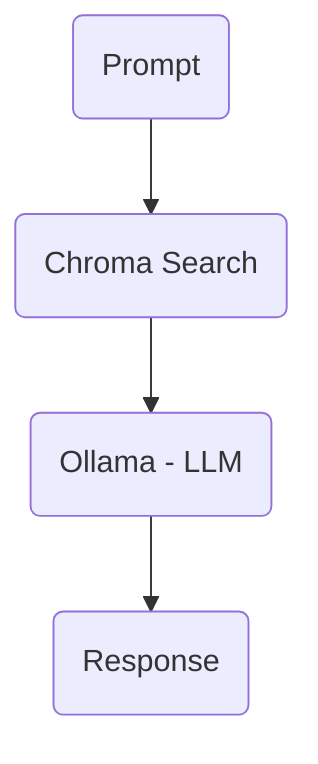

## langchain-rag

This is a forked and updated version of [pixegami's rag tutorial v2](https://github.com/pixegami/rag-tutorial-v2). 

It features the following highlights:
- Local same machine or local network [Ollama](https://ollama.com/) server for running models (encoding & prompt)
- Uses [unsturctured](https://unstructured.io/) from [langchain](https://python.langchain.com/docs/integrations/document_loaders/unstructured_file/) to load documents which will run a model locally on the machine to conduct chunking.
- One file 'config.py' to house configuration settings (model selections, server info, etc)
- Supports langchain v0.3
- Uses [chromadb](https://www.trychroma.com/) for vector store
- By using unstructured more document formats than pdf are supported and chunking the documents can be done following sections vs based pages or text blocks.

## Setup
#### Software Configuration
See requirements.txt for a list of python packages. This has been running with python 3.10.12 in a venv on the host machine. Once python packages are installed you will need to run the following:

```python -m nltk.downloader all```
#### Equipment
I have this running on two machines. This is not fast, but allows for experimentation as a personal project with on hand equipment that has other primary purposes. 

Machine A (software dev + host)
- Hardware: Lenovo m920q (CPU=i5-8500T, RAM=32GB)
- OS: Linux Mint virtual machine on ProxMox (CPU=4 cores & RAM=24 GB)
- Python: 3.10.12 (venv)

Machine B (ollama server)
- Hardware: CPU=Xeon W3690, GPU=GTX 1060 6GB, RAM=48GB
- OS: Win10
## Workflow
#### Chunking & Encoding

#### Prompt Response Generation


## Notes
#### Documet Batching
For larger document sets I have seen ollama logs report aborting of encoding due to client closing the connection and the python client on the host ignore this and contiune waiting. This was causing encoding jobs to fail, but I could not trace what was causing the failure. To avoid this I setup the chunking and encoding cycle to run each document before moving to the next document so that failures should only impact the encoding of one document and not the entire batch. Some batches have failed at 19 hrs and others at 30+ hrs. This also mitigates impacts of unplanned reboots from automatic updates on the windows machine as well. Since the change I have not seen this type of failure.
